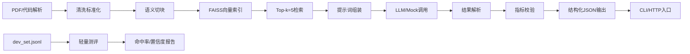

# 需求规格说明书（SRS）

## 项目名称：智能知识赋能平台

编制单位：物流供应链研发组  
编制人：齐海智  
版本号：v1.0  
日期：2025-10-27  
保密级别：内部机密

## 修订记录

| 版本号 | 日期       | 修订人 | 修订内容                         |
| ------ | ---------- | ------ | -------------------------------- |
| v1.0   | 2025-10-27 | 齐海智 | 首次发布，建立系统总体需求与功能定义 |

## 1. 引言

### 1.1 目的

本需求规格说明书（SRS）旨在明确基于 RAG 的物流供应链"智能知识赋能系统"的功能与非功能需求，为后续概要设计、开发实现和测试验收提供依据。

系统在仅 CPU 运行、离线部署、不可微调模型的约束下，完成从 PDF、Java/Python代码的解析、清洗（数据脱敏）、切块、创建索引、检索、提示词加工、LLM/Mock 调用、带引用回答、指标校验、CLI 入口、轻量测评的端到端流程。

目标是构建一个企业内网离线部署的知识问答系统，服务于物流供应链领域的研发、产品与测试人员，提升知识获取效率与文档生成质量。

### 1.2 范围

本项目覆盖以下核心能力：

1. 输入处理：支持 PDF 、Java、Python 文件的解析。
2. 知识处理：清洗、切块、向量化索引、检索。
3. 智能生成：基于检索上下文的 LLM 问答与结构化输出。
4. 质量保障：指标自动校验与置信度评估。
5. 服务入口：提供命令行接口（CLI）进行交互。
6. 测评支持：内置对 dev_set.jsonl 的轻量级评测能力。

### 1.3 约束条件

1. 系统必须仅在 CPU 上运行，不可使用 GPU
2. 系统必须支持离线部署，不可联网
3. 大语言模型不可微调
4. 系统可使用 Mock 模式替代真实大语言模型

### 1.3 术语定义

| 术语     | 定义                                                         |
| -------- | ------------------------------------------------------------ |
| RAG      | 检索增强生成（Retrieval-Augmented Generation），结合检索与生成的技术范式 |
| LLM      | 大语言模型（Large Language Model），本系统使用 MockLLM 替代  |
| FAISS    | Facebook AI Similarity Search，高效的向量相似性搜索库        |
| BM25     | 经典的信息检索算法，用于关键词匹配                           |
| Chunk    | 知识单元的最小语义块，用于向量索引                           |
| Citations| 回答中引用的来源，格式为 [{company}:{year}:p{page}]          |
| dev_set.jsonl | 开发集，每行一个 JSON 对象，含 question, expected_answer 等字段 |

## 2. 整体描述

### 2.1 用户画像与使用场景

| 角色       | 用户画像                              | 使用场景                                                     |
| ---------- | ------------------------------------- | ------------------------------------------------------------ |
| 研发工程师 | 30岁，熟悉Java/Python，负责库存服务开发 | 查询"calculate_turnover_rate 函数如何实现？"或"配送路线优化算法在哪？" |
| 产品经理   | 35岁，关注业务指标与PRD一致性           | 查询"库存周转率的计算公式是什么？"或"API响应字段有哪些？"     |
| 测试工程师 | 28岁，编写自动化测试用例               | 查询"get_inventory_level 的边界条件有哪些？"或"错误码定义"    |

典型工作流：用户通过 CLI 输入自然语言问题，系统返回带引用的结构化答案，辅助决策与文档编写。

### 2.2 端到端流程图



图1-1：系统端到端流程图

## 3. 功能性需求（FR-01~FR-10）

### FR-01 文档解析

**描述**：解析物流系统文档（如PRD）、代码库和配置文件。

**输入**：Markdown、PDF、Java/Python源文件等

**输出**：
- 代码文件：按函数/方法边界生成 Document 对象
- 文档文件：按章节/段落生成 Document 对象
- 包含 source, file_path, start_line, end_line 等元数据

**前置**：文件存在且可读

**异常**：
- 文件格式不支持  报错 ERR_UNSUPPORTED_FORMAT
- 解析失败  报错 ERR_PARSE_FAILURE

**验收口径**：
- 支持代码文件解析
- 支持文档文件解析

### FR-02 清洗标准化

**描述**：对解析后的文本进行清洗与标准化。

**输入**：原始文本片段

**输出**：清洗后的文本

**清洗规则**：
- 去除无关注释（如 TODO、FIXME）
- 修复代码断行
- 统一技术术语（如"仓库""仓储"）
- 标准化单位（如"kg""KG"）

**验收口径**：
- 清洗后文本无无关注释
- 技术术语标准化准确率 95%

### FR-03 切块

**描述**：将清洗后的文本切分为固定大小的知识块。

**输入**：清洗后的文本

**输出**：KnowledgeChunk 列表

**切块参数**：
- chunk_size = 500 字符
- overlap = 50 字符
- 保留 section（如"2.1 库存管理"）和 chunk_id

**验收口径**：
- 实际块大小 500 字符（证据：logs/chunker.log 记录 chunk.size）
- 重叠区生效（证据：相邻块有50字符重复）

### FR-04 向量索引

**描述**：构建并持久化向量索引。

**输入**：KnowledgeChunk 列表

**输出**：本地 FAISS 索引文件

**技术栈**：
- 向量数据库：FAISS
- Embedding 模型：MockEmbeddings（禁网）
- 持久化：
  - 索引文件保存至 vectorstore/ 目录
  - 支持 load_index() 和 save_index()

**验收口径**：
- 索引文件可加载（证据：ls vectorstore/faiss.index 存在）
- MockEmbeddings 无网络请求（证据：core/embedder.py 无 requests 调用）

### FR-05 检索器

**描述**：执行混合检索，返回 Top-k 结果。

**输入**：查询语句、k值、是否启用BM25

**输出**：Top-k 相关文档列表

**检索策略**：
- 默认：FAISS 向量检索
- 可选：BM25 + FAISS 混检
- 结果合并后去重
- 参数：top-k = 5

**验收口径**：
- 返回结果 5 条（证据：CLI 输出 len(citations) <= 5）
- 混检开启时条数 k 且去重（证据：logs/retriever.log 显示 deduplicated from 7 to 5 docs）

### FR-06 提示词模板

**描述**：组装 LLM 可理解的提示词。

**输入**：查询、检索结果

**输出**：标准消息序列

**模板规则**：
- 仅使用 CONTEXT 字段拼接上下文
- 强制引用格式：[Source#Location]
- 输出必须为 JSON 格式：{"answer": "...", "citations": [...], "notes": "..."}

**验收口径**：
- 引用格式符合要求
- 输出 JSON 可解析

### FR-07 LLM/MockLLM 调用与解析

**描述**：调用 LLM 并解析响应。

**输入**：提示词

**输出**：原始响应、解析后的 payload

**回退策略**：
- 调用失败回退到Mock模式
- JSON 解析失败  降级为文本片段，confidence=0.3
- 引用去重：相同 source/location 只保留一次

**验收口径**：
- 调用失败时正确回退
- 引用无重复

### FR-08 指标校验

**描述**：校验生成答案中的物流指标与基准值的一致性。

**输入**：LLM 抽取的指标值、基准值

**输出**：notes、confidence 调整

**校验逻辑**：
- 支持字段：inventory_turnover, shipment_on_time_rate, avg_delivery_time
- 差值 ≤ 5%：视为一致，confidence ≥ 0.8
- 差值 >5%：写入 notes="XX超差X.X%"，confidence ≤ 0.5

**验收口径**：
- 超差时 notes 包含说明
- confidence 按规则调整

### FR-09 输出结构化

**描述**：生成统一格式的结构化输出。

**输出 JSON 字段**：

```json
{
  "answer": "回答内容",
  "citations": ["[WarehouseService.java#L145-167]"],
  "key_points": ["关键点1", "关键点2"],
  "notes": "补充说明",
  "confidence": 0.78,
  "used_metrics": [{"name": "inventory_turnover", "value": 4.7, "unit": "times/year"}]
}
```

**验收口径**：
- 字段完整
- citations 非空且可反查

### FR-10 入口

**描述**：提供 CLI 命令行接口。

**命令1**： python main.py run --build-index
**输出**：向量库索引文件vectorstore/faiss.index

**命令2**： python main.py run --question 查询"配送路线优化算法在哪？"

**输出**：符合FR-09要求的JSON到终端

**验收口径**：
- 命令执行成功
- 输出符合 JSON 规范

## 4. 非功能性需求（NFR-01~NFR-05）

| ID     | 需求     | 验收口径                                   |
| ------ | -------- | ------------------------------------------ |
| NFR-01 | 可运行性 | 仅 CPU 运行，禁用 GPU 和网络               |
| NFR-02 | 鲁棒性   | 空目录/不支持格式/非法问题优雅报错         |
| NFR-03 | 日志     | INFO/ERROR/EXCEPTION 分级记录              |
| NFR-04 | 可维护性 | 配置中心 .env + 默认值；依赖清单 requirements.txt |
| NFR-05 | 合规     | 数据脱敏，无外部依赖                       |

## 5. 数据与文件规范

### 5.1 目录结构

```
project/
├── data/                 # 数据文件目录
├── vectorstore/          # 向量索引存储目录
├── logs/                 # 日志文件目录
├── test_data/            # 测试数据目录
├── docs/                 # 文档目录
├── tests/                # 测试文件目录
└── requirements.txt      # 依赖清单文件
```

### 5.2 文件命名规范

- 源代码：{module_name}.py
- 文档文件：{topic}.{md/pdf}
- 索引文件：faiss.index
- 日志文件：app_{YYYYMMDD}.log

## 6. 接口规范

### 6.1 查询命令

提供两种接口方式，选择其一实现：

#### CLI接口

```
python main.py run --question 查询"配送路线优化算法在哪？"
```


### 6.2 输出

```
{
  "answer": "配送路线优化算法在`test_data/TMSTransportationPlanner.py`文件中的`optimize_delivery_route`方法实现，该方法使用贪心算法进行简单的路线优化。",
  "confidence": 0.9,
  "citations": [
    "[test_data/TMSTransportationPlanner.py#unknown]",
    "[test_data/LogisticsAPI.md#unknown]",
    "[test_data/HaizhiLogistics.pdf#unknown]"
  ],
  "key_points": [
    "配送路线优化算法在`test_data/TMSTransportationPlanner.py`文件中的`optimize_delivery_route`方法实现，该方法使用贪心算法进行简单的路线优化"
  ],
  "notes": "来自大模型的直接响应",
  "used_metrics": []
}
```

## 7. 验收与评测口径

### 7.1 评测方法

使用 dev_set.jsonl 进行自动化评测：

```
python evaluate.py \
  --dataset dev_set.jsonl \
  --output report_20250518.json
```

### 7.2 关键指标

| 指标         | 定义                         | 目标值 |
| ------------ | ---------------------------- | ------ |
| 可运行性     | 系统可在仅CPU、离线环境运行  | 100%   |
| 相关性       | 回答与问题的相关程度         | 90%    |
| 完整性       | 输出字段完整且符合规范       | 100%   |
| 引用准确性   | citations可反查的比例        | 95%    |
| 指标一致率   | 同公司/同年度，5%内一致的比例| 95%    |
| 鲁棒性       | 异常输入处理能力             | 100%   |

表7-1：验收指标

## 8. 需求-设计-用例追踪矩阵

| 需求ID | 需求描述       | 设计模块            | 测试用例ID/说明      |
| ------ | -------------- | ------------------- | --------------- |
| FR-01  | 文档解析       | ParserModule        | TC-01, TC-02, [test_loader.py](file:///Users/vick.qi/PycharmProjects/CodeEmpowerSystem/tests/test_loader.py) |
| FR-02  | 清洗标准       | CleanerModul        | TC-03, [test_cleaner.py](file:///Users/vick.qi/PycharmProjects/CodeEmpowerSystem/tests/test_cleaner.py) |
| FR-03  | 切块           | ChunkerModule       | TC-04, [test_chunker.py](file:///Users/vick.qi/PycharmProjects/CodeEmpowerSystem/tests/test_chunker.py) |
| FR-04  | 向量索引       | VectorStoreModule   | TC-05, [test_indexer.py](file:///Users/vick.qi/PycharmProjects/CodeEmpowerSystem/tests/test_indexer.py) |
| FR-05  | 检索器         | RetrieverModule     | TC-06, TC-07, [test_retriever.py](file:///Users/vick.qi/PycharmProjects/CodeEmpowerSystem/tests/test_retriever.py) |
| FR-06  | 提示词模板     | PromptorModule      | TC-08, [test_prompt.py](file:///Users/vick.qi/PycharmProjects/CodeEmpowerSystem/tests/test_prompt.py) |
| FR-07  | LLM调用与解析  | LLMModule           | TC-09, [test_llm.py](file:///Users/vick.qi/PycharmProjects/CodeEmpowerSystem/tests/test_llm.py), [test_parser.py](file:///Users/vick.qi/PycharmProjects/CodeEmpowerSystem/tests/test_parser.py) |
| FR-08  | 指标校验       | MetricValidatorModule | TC-15, TC-16, [test_metric_validator.py](file:///Users/vick.qi/PycharmProjects/CodeEmpowerSystem/tests/test_metric_validator.py) |
| FR-09  | 输出结构化     | ParserModule        | [test_parser.py](file:///Users/vick.qi/PycharmProjects/CodeEmpowerSystem/tests/test_parser.py) |
| FR-10  | CLI入口        | CLIModule           | TC-20, [main.py](file:///Users/vick.qi/PycharmProjects/CodeEmpowerSystem/main.py) CLI测试 |
| NFR-01 | 可运行性       | ConfigModule        | TC-21, [test_settings.py](file:///Users/vick.qi/PycharmProjects/CodeEmpowerSystem/tests/test_settings.py) |
| NFR-02 | 鲁棒性         | ErrorHandlerModule  | TC-18, [test_parser.py](file:///Users/vick.qi/PycharmProjects/CodeEmpowerSystem/tests/test_parser.py) |
| NFR-03 | 日志           | LoggerModule        | TC-23, [test_logger.py](file:///Users/vick.qi/PycharmProjects/CodeEmpowerSystem/tests/test_logger.py) |
| NFR-04 | 性能           | BenchmarkModule     | TC-22, [evaluate.py](file:///Users/vick.qi/PycharmProjects/CodeEmpowerSystem/evaluate.py) 性能评估 |
| NFR-05 | 可维护性       | ConfigModule        | TC-24, [settings.py](file:///Users/vick.qi/PycharmProjects/CodeEmpowerSystem/settings.py) 配置管理 |
| NFR-06 | 合规           | SanitizerModule     | TC-25, [test_sanitizer.py](file:///Users/vick.qi/PycharmProjects/CodeEmpowerSystem/tests/test_sanitizer.py) |

表8-1：需求-用例-设计追踪矩阵

## 9. 附件：流程图源文件说明

本 SRS 中的流程图（图1-1）对应的mermaid代码：

```
graph LR
A[文档解析] --> B[清洗标准化]
B --> C[切块 chunk_size=500]
C --> D[FAISS向量索引]
D --> E[Top-k=5检索]
E --> F[提示词组装]
F --> G[MockLLM调用]
G --> H[结果解析]
H --> I[指标校验]
I --> J[结构化JSON输出]
J --> K[CLI展示]
L[dev_set.jsonl] --> M[轻量测评]
M --> N[命中率/置信度报告]
```